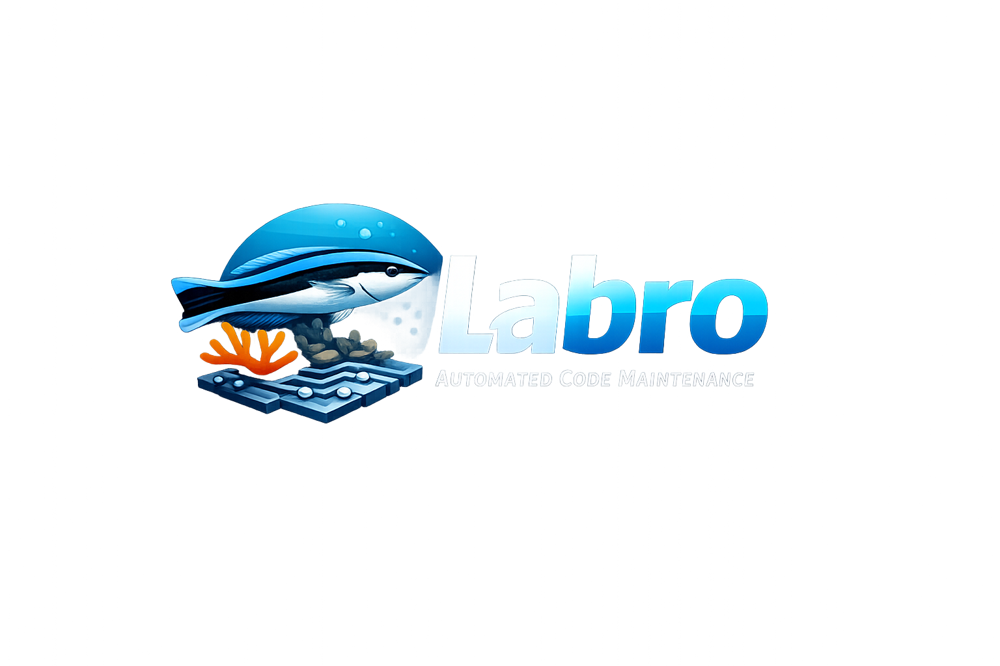

# Labro — Autonomous Agent Harness



[](LICENSE)
[](pyproject.toml)
[](https://github.com/rssrn/labro/pkgs/container/labro)
[](https://github.com/rssrn/labro/actions/workflows/ci-python.yml)
[](https://github.com/rssrn/labro/actions/workflows/ci-dashboard.yml)
[](https://github.com/astral-sh/uv)
[](https://github.com/astral-sh/ruff)
[](https://mypy-lang.org/)
[](https://github.com/PyCQA/bandit)
[](https://claude.ai/code)
[](https://opencode.ai)
[](https://github.com)

**Labro runs AI coding agents on a schedule so you don't have to watch them.**

See [Why Labro](docs/WHY.md) for the design rationale: why supervision is the bottleneck, why scheduled complements event-driven, and why the harness stays simple.  [Live dashboard →](https://labro.rossarnold.uk/)

- **Runs on a schedule** — cron-driven via GitHub Actions or a dedicated server; no one needs to be at the keyboard
- **Picks the right task from your GitHub Issues backlog** — you define label and author rules that determine priority
- **Safeguards** — daily budget cap, model fallback on failure, and configurable tool-use restrictions
- **Full audit trail** — every run records outcome, cost, tokens, and actions to a local SQLite database

## At a glance

A Labro project is configured in a single TOML file.  Here's a minimal example that monitors issues labelled `ai-dev`, runs the agent hourly, and posts a comment or opens a PR:

```toml
[defaults]
model = "claude-code"            # which agent + model to use

[personas.senior-dev]
prompt = """
Act as a senior developer. If reasonably possible, raise a PR for this ticket.
If a PR is not reasonably possible (e.g. unclear or contradictory requirements),
post a comment asking questions. In your comment, namecheck an appropriate
person or people from the issue history.
"""

[[projects]]
name    = "my-project"
repo    = "my-org/my-repo"
cron    = "0 * * * *"            # run hourly

[[projects.task_sources]]
type = "gh-label"                # pick from GitHub issues with a matching label

[[projects.task_sources.label_rules]]
label             = "ai-dev"          # pick one open issue with this label
done_label        = "ai-dev-done"     # apply this label on success
persona           = "senior-dev"      # which persona prompt to use
permitted_actions = ["comment_on_issue", "open_pr"]  # what the agent may do
```

With more config, Labro can also review Dependabot PRs (with security-alert cross-referencing) and surface [proactive improvement suggestions](docs/OPERATIONS.md#proactive-improvement--perspectives) — all from the same TOML file.

For a full reference with personas, shared rules, dashboards, and multi-project setups, see [`labro.example.toml`](labro.example.toml) or a [live production config](https://github.com/rssrn/labro-rssrn/blob/main/labro.toml).

## Getting Started

- **Docker (recommended for production):** [QUICKSTART.md](QUICKSTART.md) — clone, build, configure, and run.
- **Local Python (recommended for development):** [QUICKSTART.md](QUICKSTART.md) — same file, second section.
- **Deployment:** [docs/DEPLOYMENT.md](docs/DEPLOYMENT.md) — GitHub Actions cron, dedicated server with crond, config-repo workflow.

---

## Metrics Dashboard

**Live example:** [labro.rossarnold.uk](https://labro.rossarnold.uk/)

A read-only static SPA (React + Vite + sql.js) served from an S3-compatible blob store (e.g. Cloudflare R2). It loads a published snapshot of `labro.db` client-side and renders a runs list, per-project stats, and charts — no runtime link to the harness.

> **⚠️ Data sensitivity:** the published snapshot contains private-repo prose. The dashboard ships **no built-in access control**. If your repo contents are sensitive, do not use this feature. See [ADR-0007](docs/adr/0007-metrics-dashboard.md).

Full setup guide: [Metrics Dashboard](docs/DASHBOARD.md)

---

## Documentation

- **[QUICKSTART.md](QUICKSTART.md)** — Docker and local Python setup, step by step.
- **[Why Labro](docs/WHY.md)** — design rationale: why cron not webhooks, the autonomy model, and the project philosophy.
- **[Deployment Guide](docs/DEPLOYMENT.md)** — GitHub token setup, Docker deployment modes (GitHub Actions and a dedicated server), graceful restart procedure, and config-repo workflow.
- **[Operations Reference](docs/OPERATIONS.md)** — live run loop internals, environment variables, label transitions, turn-limit handling, daily budget cap, signal collection, and CLI reference.
- **[Model Selection Guide](docs/MODEL-SELECTION.md)** — advice on choosing agents and models per task type, with cost-shaping strategies and caveats.
- **[Architecture](docs/ARCHITECTURE.md)** — system context, component design, runtime flow, and architectural decisions.
- **[Metrics Dashboard](docs/DASHBOARD.md)** — S3-compatible blob store setup, `[dashboard]` config, snapshot publishing, and SPA deployment.
- **[Product Requirements Document](docs/PRD.md)** — problem statement, design principles, functional requirements, and success metrics.
- **[Roadmap](docs/ROADMAP.md)** — delivery milestones and per-file completion tracking.
- **[Architectural Decision Records](docs/adr/)** — record of significant design decisions.
- **[Contributing](CONTRIBUTING.md)** — development setup, testing, code quality gates, and security reporting.
- **[Domain Glossary](CONTEXT.md)** — canonical definitions for terms used across all Labro documents and code.

---

## Contributing

See [CONTRIBUTING.md](CONTRIBUTING.md) for development setup, testing, code quality gates, and security reporting.

## License

Apache-2.0 — see [LICENSE](LICENSE).
